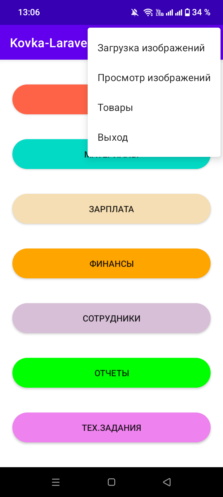
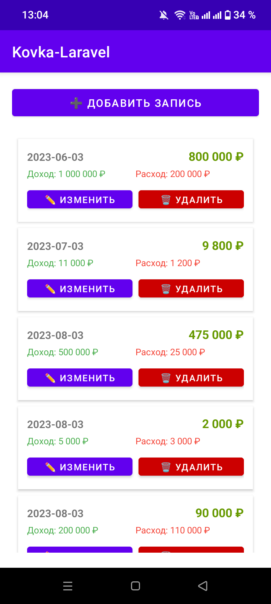

# 📱 Мобильное приложение-админка к проекту kovka-laravel

---

### 📊 Статус проекта
✅ **Опубликовано в RuStore** — доступно для скачивания  
✅ **Полный функционал** — все модули CRM работают с сервером  
✅ **Синхронизация с backend** — данные обновляются через REST API  
✅ **Готово к внедрению** — может быть адаптировано под реальный бизнес

---

### 🎯 О приложении

**Kovka-laravel** — Мобильное приложение-админка для управления интернет-магазином кованых изделий. Позволяет владельцу и сотрудникам управлять заказами, изделиями, материалами и финансами прямо с телефона, без необходимости открывать браузер.

Приложение работает в связке с backend-сервером (PHP + MySQL) через REST API и полностью повторяет функционал веб-админки.

---

### ✨ Функционал

- 🔐 **Авторизация** — вход по логину и паролю с сервера
- 📦 **Заказы** — просмотр, редактирование, смена статуса
- 🔨 **Изделия** — управление каталогом, создание и редактирование
- 🧱 **Материалы** — учёт материалов и расхода
- 👷 **Сотрудники** — список, роли, доступы
- 💰 **Финансы** — доходы, расходы, зарплаты
- 📊 **Отчёты** — сводная аналитика по бизнесу
- 🔄 **Рабочий процесс** — отслеживание этапов производства
- 🖼 **Изображения** — загрузка и управление фото изделий

---

### 📸 Скриншоты

👉 Нажмите, чтобы развернуть скриншоты приложения

 

| Главная | Заказы | Изделия |
| :---: | :---: | :---: |
|  |  |  |
| **Редактирование заказа** | **Отчеты** | **Рабочий процесс** |
|  |  |  |
| **Сотрудники** | **Финансы** | |
|  |  | |

---

### 🛠️ Технологии

| Компонент | Технологии |
|-----------|------------|
| **Язык** | Java |
| **Сеть** | Volley |
| **Формат данных** | JSON |
| **Работа с изображениями** | Glide |

---

### 🔗 Ссылки

- 📱 **Google Play:** [ссылка на приложение](https://play.google.com/store/apps/details?id=ваш.package)
- 📂 **GitHub (backend Laravel):** [korolewsanya/kovka-laravel](https://github.com/korolewsanya/kovka-laravel)
- 📂 **GitHub (backend PHP):** [korolewsanya/kovka-php](https://github.com/korolewsanya/kovka-php)
- 🌐 **Сайт проекта:** [ваш-домен.ru](https://ваш-домен.ru)

---

### 🔑 Тестовый доступ

> Подходит для входа в мобильное приложение и веб-админку

| Роль | Логин | Пароль |
| :--- | :--- | :--- |
| Администратор | `admin@kovka.com` | `12345678` |
| Рабочий | `employee@kovka.com` | `12345678` |

---

### 📌 О проекте

> Мобильное приложение разработано как часть портфолио-проекта **«kovka-laravel»** для демонстрации навыков Android-разработки на Java и работы с REST API. Приложение полностью функционально и может быть адаптировано под реальный бизнес.

---

### 📄 Лицензия

Проект распространяется под лицензией **MIT**. Подробности в файле [LICENSE](LICENSE).

---
